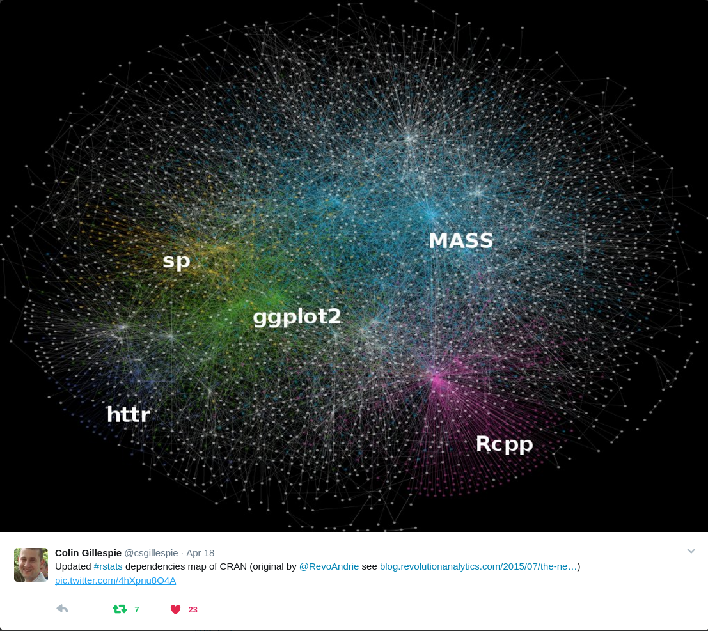

```{r setup, include=FALSE}
knitr::opts_chunk$set(echo = TRUE, collapse = TRUE)
```

The R-markdown source of the tutorial is found [here](https://raw.githubusercontent.com/edzer/UseR2017/master/tutorial.Rmd).

Required packages:
```{r eval=FALSE}
install.packages(c("sf", "tidyverse", "devtools"))
```

## A short history of handling spatial data in R

* pre-2003: several people doing spatial statistics or map manipulation with S-Plus, and later R (e.g. spatial in MASS; spatstat, maptools, geoR, splancs, gstat, ...)
* 2003: workshop at [DSC](https://www.r-project.org/conferences/DSC-2003/), concensus that a package with base classes should be useful; this ended up being a multiplicator
* 2003: start of [r-sig-geo](https://stat.ethz.ch/mailman/listinfo/r-sig-geo)
* 2003: [rgdal](https://cran.r-project.org/package=rgdal) released on CRAN
* 2005: [sp](https://cran.r-project.org/package=sp) released on CRAN; sp support in rgdal
* 2008: [Applied Spatial Data Analysis with R](http://www.asdar-book.org/)
* 2011: [rgeos](https://cran.r-project.org/package=rgeos) released on CRAN
* 2013: second edition of [Applied Spatial Data Analysis with R](http://www.asdar-book.org/)
* 2016-7: [simple features for R](https://cran.r-project.org/package=sf), R consortium support (considered pretty much "finished")
* 2017-8: [spatiotemporal tidy arrays for R](https://github.com/edzer/stars), R consortium support (design phase)
* 2018: ggplot2 3.0.0 supports plotting of simple features



## Simple feature access in R: package `sf`

Simple feature access is an [ISO standard](http://www.opengeospatial.org/standards/sfa) that is widely adopted. It is used in spatial databases, GIS, open source libraries, GeoJSON, GeoSPARQL, etc.

What is this about?

* _feature_: abstraction of real world phenomena (type, or instance)
* _simple feature_: feature with all geometric attributes described piecewise by straight line or planar interpolation between sets of points 
* 7 + 10 [types](https://en.wikipedia.org/wiki/Well-known_text#Well-known_binary), 68 classes, of which 7 used in like 99% of the use cases
* text and binary serialisations (WKT, WKB)
* support for mixed type (`GEOMETRYCOLLECTION`), and type mix (`GEOMETRY`)
* support for empty geometry (empty set: somewhat like `NA`)

```{r}
library(sf)
```
links to 
[GEOS](https://trac.osgeo.org/geos/), 
[GDAL](http://www.gdal.org/), 
[Proj.4](http://proj4.org/), 
[liblwgeom](https://github.com/postgis/postgis/tree/svn-trunk/liblwgeom); see also the [package vignettes](https://cran.r-project.org/package=sf)

_access_ refers to standardised encodings, such as well-known text (WKT):
```{r}
(pt = st_point(c(2,4)))
```
and well-known binary,
```{r}
(pt_bin = st_as_binary(pt))
```
the binary form in which spatial databases put geometries in BLOBs, binary large objects, converted back by
```{r}
st_as_sfc(list(pt_bin))[[1]]
```
as well as to _names_ of functions to manipulate objects, e.g.
```{r}
st_dimension(pt)
st_intersects(pt, pt, sparse = FALSE)
```

package `sf` uses simple R structures to store geometries:
```{r}
str(pt)
str(st_linestring(rbind(c(0,0), c(0,1), c(1,1))))
str(st_polygon(list(rbind(c(0,0), c(0,1), c(1,1), c(0,0)))))
```

## Tidyverse, list-columns

According to the "tidy data" paper ([Wickham 2014](https://www.jstatsoft.org/article/view/v059i10)), data is tidy when

1. Each variable forms a column.
2. Each observation forms a row.
3. Each type of observational unit forms a table.

but it is not directly clear how this maps to geometries: should a coordinate dimension (e.g. latitude) form a column, should each coordinate (x,y pair) form a colum, or should a whole geometry (e.g. polygon, with holes), form a column? Early attempts (and ggplot2 up to version 2.2.1) wanted _simple_ columns, meaning each coordinate split over two columns. An approach called _fortify_ would mold (tidy?) polygons into simple `data.frame`s. It is [well known](https://github.com/tidyverse/ggplot2/wiki/plotting-polygon-shapefiles) that this approach has its limitations when polygons have holes.

Since the [UseR! 2016 keynote](https://channel9.msdn.com/Events/useR-international-R-User-conference/useR2016/Towards-a-grammar-of-interactive-graphics) of Hadley, list-columns have been declared tidy. One of the arguments for this was exactly this: polygons with holes are hard to represent in simple `data.frame`s. Other cases are: nested `data.frame`s, or columns that contain, for each record, a model object e.g. obtained from `lm`.

The tidy data rule for simple feature means: we have a `data.frame` **where each _feature_ forms a row**. A single column (a list-column) contains the geometry for each observation. This resembles spatial databases, such as [PostGIS](http://www.postgis.net/).

Package `sf` puts features in `sf` tables deriving from `data.frame` or `tbl_df`, which have geometries in a list-column of class `sfc`, where each list element is a single feature's geometry of class `sfg`. Feature geometries are represented in R by

* a numeric vector for a single point (`POINT`)
* a numeric matrix (each row a point) for a set of points (`MULTIPOINT` or `LINESTRING`)
* a list of matrices for a set of set of points (`MULTIINESTRING`, `POLYGON`)
* a list of lists of matrices  (`MULTIPOLYGON`)
* a list of anything mentioned above  (`GEOMETRYCOLLECTION`)

(all other classes also fall in one of these categories)

Other tidy aspects of `sf`:

* all functions/methods start with `st_` (press tab to search), use `_` and lower case
* all function have data as first argument, "pipe-friendly"
* `read_sf` is an alias for `st_read` with tidy defaults: silent, `stringAsFactors = FALSE`
* many tidy verbs implemented as methods for `sf` objects (see further down)

## Reference systems

If one wants to know which position of the Earth we refer to, coordinates of geospatial data require a reference system:

* geodesic/geographic coordinates need an order (long/lat or lat/long?), a unit (rad, arc_degree?) and a datum (a reference ellipsoid: WGS84, ETRS89, NAD27?)
* cartesian/projected coordinates (e.g. UTM, web Mercator) need also measurement units, and some way of encoding how they relate to geodesic coordinates, in which datum (the Proj.4 string)

To handle coordinate reference systems, to convert coordinates (projections) and do datum transformations, [Proj.4](http://proj4.org/) is the code base most widely adopted, and actively maintained, by the open source geospatial community.

Package `sf` has `crs` objects that register coordinate reference systems:
```{r}
st_crs("+proj=longlat +datum=WGS84")  # "Proj.4 string"
st_crs(3857)                          # EPSG code
st_crs(3857)$units                    # reveal units
st_crs(NA)                            # unknown (assumed planar/Cartesian)
```

`crs` objects are registered as an attribute of geometry collections.

## sf: handling real data

### reading and writing spatial data

```{r}
fname = system.file("shape/nc.shp", package = "sf")
nc = read_sf(fname)
print(nc, n = 3)
plot(nc)
```

### coordinate transformation/conversion

* `st_transform`: transforms or converts coordinates to new reference system

```{r}
(a1 = st_area(nc[1,]))                      # area, using geosphere::areaPolygon
(a2 = st_area(st_transform(nc[1,], 32119))) # NC state plane, m
(a3 = st_area(st_transform(nc[1,], 2264)))  # NC state plane, US foot
units::set_units(a1, km^2)
units::set_units(a2, km^2)
units::set_units(a3, km^2)
```

From here on, we will work with the `nc` dataset in projected coordinates:
```{r}
nc = st_transform(nc, 32119) # NC state plane, m
```

## Methods for simple features

A complete list of methods for a particular class is obtained, after loading the class, by
```{r, eval = FALSE}
methods(class = "sf")
```

### book keeping, low-level I/O

* `st_as_text`: convert to WKT     
* `st_as_binary`: convert to WKB
* `st_as_sfc`: convert geometries to `sfc` (e.g., from WKT, WKB)
* `as(x, "Spatial")`: convert to `Spatial*`
* `st_as_sf`: convert to sf (e.g., convert from `Spatial*`)

### logical binary geometry predicates

* `st_intersects`: touch or overlap
* `st_disjoint`: !intersects
* `st_touches`: touch
* `st_crosses`: cross (don't touch)
* `st_within`: within
* `st_contains`: contains
* `st_overlaps`: overlaps
* `st_covers`: cover
* `st_covered_by`: covered by
* `st_equals`: equals
* `st_equals_exact`: equals, with some fuzz

returns an object of class `sgbp` (sparse geometry binary predicate); there is an `as.matrix` method for these objects to get the dense logical matrix (which may become huge when you have many features):
```{r}
nc1 = nc[1:5,]
(i = st_intersects(nc1, nc1))
as.matrix(i)[1:5,1:5]
```

### geometry generating logical operators

* `st_union`: union of several geometries
* `st_intersection`: intersection of pairs of geometries
* `st_difference`: difference between pairs of geometries
* `st_sym_difference`: symmetric difference (`xor`)

```{r, fig=TRUE}
opar = par(mfrow = c(1,2))
ncg = st_geometry(nc[1:3,])
plot(ncg, col = sf.colors(3, categorical = TRUE))
u = st_union(ncg)
plot(u, lwd = 2)
plot(st_intersection(ncg[1], ncg[2]), col = 'red', add = TRUE)
plot(st_buffer(u, 10000), border = 'blue', add = TRUE)
# st_buffer(u, units::set_unit(10, km)) # with sf devel
plot(st_buffer(u, -5000), border = 'green', add = TRUE)
par(opar)
```

### higher-level intersections and differences

If you want not only intersections of differences for _pairs_ of geometries, but e.g. all unique, non-intersecting polygons resulting from higher-order intersections, or unique differences from sequential differencing, you can use `st_intersection` or `st_difference` with a single argument.

See the examples in the [documentation](https://r-spatial.github.io/sf/reference/geos_binary_ops.html).

This means that `st_intersection(x)` does something different from `st_intersection(x,x)`, which may confuse sometimes.

### higher-level operations: summarise, interpolate, aggregate, st_join

* `aggregate` and `summarise` use `st_union` (by default) to group feature geometries
* `st_interpolate_aw`: area-weighted interpolation, uses `st_intersection` to interpolate or redistribute attribute values, based on area of overlap:
* `st_join` uses one of the logical binary geometry predicates (default: `st_intersects`) to join records in table pairs

```{r}
g = st_make_grid(nc, n = c(20,10))
a1 = st_interpolate_aw(nc["BIR74"], g, extensive = FALSE)
sum(a1$BIR74) / sum(nc$BIR74) # not close to one: property is assumed spatially intensive
a2 = st_interpolate_aw(nc["BIR74"], g, extensive = TRUE)
sum(a2$BIR74) / sum(nc$BIR74)
#a1$intensive = a1$BIR74
#a1$extensive = a2$BIR74
#plot(a1[c("intensive", "extensive")])
a1$what = "intensive"
a2$what = "extensive"
# devtools::install_github("tidyverse/ggplot2")
library(ggplot2)
l = st_cast(nc, "MULTILINESTRING")
ggplot() + geom_sf(data = rbind(a1,a2), aes(fill = BIR74)) + 
	geom_sf(data = l, col = 'lightgray') + facet_grid(what~.) +
    scale_fill_gradientn(colors = sf.colors(10))
```

Example of `st_join`:
```{r}
# find county matching a coordinate:
pt = st_point(c(472038, 210385))
pt_sfc = st_sfc(pt, crs = st_crs(nc))
pt_sf = st_sf(a = 1, geom = pt_sfc)
st_join(pt_sf, nc)
st_join(nc, pt_sf, left = FALSE) # full join
# join-with-self:
nrow(nc)
x = st_join(nc, nc)
nrow(x) # neighbours AND each state with itself
x = st_join(nc, nc, join = st_touches)
nrow(x) # neighbours, now excluding itself
st_rook = function(a, b, prepared) st_relate(a, b, pattern = "F***1****")
x = st_join(nc, nc, join = st_rook)
nrow(x) # "rook" neighbours: touch over a line, not in a point
# which states touch another state in a point only?
sel = unlist(st_relate(nc, nc, pattern = "F***0****"))
plot(st_geometry(nc))
plot(st_geometry(nc[sel,]), add = TRUE, col = 'grey')
```

see also [this issue](https://github.com/edzer/sfr/issues/234).

Which points touch four states?

```{r}
pts = st_intersection(nc, nc)
pts = pts[st_dimension(pts) == 0, ]
plot(st_geometry(nc))
plot(st_geometry(nc[sel,]), add = TRUE, col = 'grey')
plot(st_geometry(pts), add = TRUE, col = '#ff000044', pch = 16)
# how many neighbours does each of these points have?
unique(lengths(st_intersects(pts, nc)))
```

### manipulating geometries

* `st_line_merge`: merges lines
* `st_segmentize`: adds points to straight lines
* `st_voronoi`: creates voronoi tesselation
* `st_centroid`: gives centroid of geometry
* `st_convex_hull`: creates convex hull of set of points
* `st_triangulate`: triangulates set of points (not constrained)
* `st_polygonize`: creates polygon from lines that form a closed ring
* `st_simplify`: simplifies lines by removing vertices
* `st_split`: split a polygon given line geometry
* `st_buffer`: compute a buffer around this geometry/each geometry
* `st_make_valid`: tries to make an invalid geometry valid (requires lwgeom)
* `st_boundary`: return the boundary of a geometry

### convenience functions

* `st_zm`: sets or removes z and/or m geometry
* `st_coordinates`: retrieve coordinates in a matrix or data.frame
* `st_geometry`: set, or retrieve `sfc` from an `sf` object
* `st_is`: check whether geometry is of a particular type

### handling mixes: `GEOMETRY`, `GEOMETRYCOLLECTION`

We can have mixes of geometries with different types at two levels: at the feature level, and at the feature set level. At the feature level:
```{r}
p = st_point(c(0,1))
mp = st_multipoint(rbind(c(1,1), c(3,3)))
ls = st_linestring(rbind(c(1,1), c(3,3)))
(gc = st_geometrycollection(list(p, mp)))
(g = st_sfc(gc))
st_collection_extract(g, "POINT")
```

Where do these come from? For instance from `st_intersection`:
```{r}
opar <- par(mfrow = c(1, 2))
a <- st_polygon(list(cbind(c(0,0,7.5,7.5,0),c(0,-1,-1,0,0))))
b <- st_polygon(list(cbind(c(0,1,2,3,4,5,6,7,7,0),c(1,0,.5,0,0,0.5,-0.5,-0.5,1,1))))
plot(a, ylim = c(-1,1))
title("intersecting two polygons:")
plot(b, add = TRUE, border = 'red')
(i <- st_intersection(a,b))
plot(a, ylim = c(-1,1))
title("GEOMETRYCOLLECTION")
plot(b, add = TRUE, border = 'red')
plot(i, add = TRUE, col = 'green', lwd = 2)
par(opar)
```

At the feature set level we end up with `GEOMETRY` objects:
```{r}
(gm = st_sfc(p, mp, ls))
```
How to deal with such messy data? One thing we could do is select:
```{r}
sf = st_sf(a = 1:3, geom = gm)
st_dimension(sf)
sf[st_dimension(sf) == 1,]
```
another is to cast geometries to a common class:
```{r}
st_cast(sf, "MULTIPOINT")
```
which converts the `LINESTRING` to a `MULTIPOINT` as well.

`st_cast` also tries to unravel `GEOMETRYCOLLECTION` geometries in their parts:
```{r}
(parts = st_cast(st_sf(a = 1, geometry = st_sfc(gc))))
```
potentially repeating associated attributes, and tries to find a common class when given no argument 
```{r}
st_cast(parts)
```

### empty geometries

Empty geometries serve the role of `NA`, or missing values, for geometries, but they are typed:
```{r}
st_point()
st_geometrycollection()
```

They can be detected by `st_is_empty`:
```{r}
st_sfc(st_point(0:1), st_point(), st_geometrycollection()) %>% st_is_empty
```


## Pipe-based workflows and tidyverse

When _both_ `sf` and `dplyr` are loaded, a number of generic methods in the `tidyverse` become available for `sf` objects. They are:
```{r}
m1 = attr(methods(class = "sf"), "info")$generic
library(tidyverse)
m2 = attr(methods(class = "sf"), "info")$generic
noquote(setdiff(m2, m1))
```
Most of these do little more than simply make sure the returned object is of class `sf` again, but some of them do more, e.g. `summarise` by default aggregates (unions) the summarised geometries:
```{r, plot=TRUE}
cent <- st_geometry(nc) %>% st_centroid %>% st_coordinates 
nc1 <- nc %>% 
  mutate(area = as.numeric(st_area(.)), longitude = cent[,1]) %>%
  group_by(cut(longitude,4))  %>% 
  summarise(area = sum(area), BIR79 = sum(BIR79), dens = mean(BIR79/area))
ggplot(nc1) + geom_sf(aes(fill = dens))
```

## Array data: rasters, spatial time series

Although `sp` has some simple infrastructure for them in the `Spatial` class framework, raster data in R are best handled by the `raster` package. It is feature-rich, well integrated with the `Spatial` class framework, and can deal with massive rasters, as long as they fit on the local disk. It does not integrate particularly well with the tidyverse, or with simple features. Neither does it handle four- or higher-dimensional dimensional data (e.g. x,y.t,color), or time series data for features.

A follow-up project of the "simple features for R" project tries to address a number of these issues

## Summary/outlook

In comparison to `sp`, package `sf`

* implements all types and classes of simple features
* has no support for gridded (raster) data
* uses `data.frame`s for features, and list columns for feature geometry
* uses S3 instead of S4
* is also built on top of GDAL, GEOS and Proj.4
* tries to provide a simpler and cleaner API (or user experience) conversions to/from `sp` makes it still easy to work "backwards"

What's really new, and better in `sf`, compared to `sp`?

* simple features is a widely adopted standard
* tidyverse compatibility
* ggplot2 support
* rigorous support for measurement [units](https://r-quantities.github.io/units/)
* (partial) support for computations using geographic coordinates
* support by [mapview](https://cran.r-project.org/package=mapview), [tmap](https://cran.r-project.org/package=tmap), [mapedit](https://github.com/r-spatial/mapedit); 70 revdeps on CRAN
* binary geometry ops: fast (indexed), low memory footprint
* `st_join` for spatial joins, with flexible (user-definable) join predicates
* (c)lean Rcpp interface to external dependencies GDAL/GEOS/PROJ
* fast WKB (de)serialization, in C++

### Exercises

Load library `mapview` by
```{r}
library(mapview)
```
possibly after installing it. Consider the datasets `breweries`, `trails` and `franconia`, which are available after loading `mapview`. (Note that the `trails` dataset is a subset from a larger dataset, based on constraining distances to existing breweries.)

1. For each of the datasets, describe which geometry type it has, how many features (observations) and attributes (variables) it has.
2. Plot each of the three objects.
3. Export the `franconia` dataset to a geopackage file (`franconia.gpkg`) and try to view that file in QGIS (if you have that available on your computer).
5. compare the coordinate reference systems (CRS) of the three objects. In case of differing coordinate reference systems, convert all of them to a single CRS.
6. For each of the trails, find out which brewery is closest to the trail.
7. For each of the trails, find out the distance to the clostest brewery.
8. For each of the trails, find out how many breweries it has that are less than 500 m away from the trail, per km of trail.
9. For each of the regions in `franconia`, find out how many `breweries` it contains, and add this number as a field to the `franconia` object.
10. For each of the regions in `franconia`, count the total `number.of.types` of beers brewed by the all the breweries in the region. 
11. Count the total length of the trails per region in `franconia`
